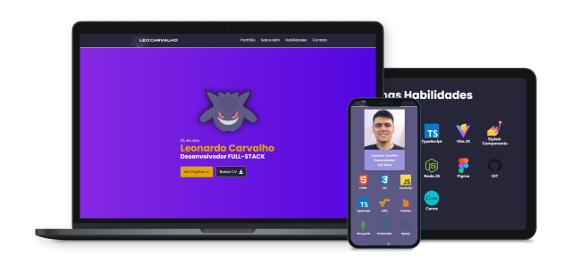

  

# 👨🏻‍💻 Portfólio

- Um site feito em React para servir de portfólio e mostrar meus projetos que fiz até agora. Usei algumas tecnologias bem legais como o React.JS, TailwindCSS e ViteJS para o desenvolvimento rápido. Futuramente planejo colocar um seção de blog.

 

	

 

# 👨🏻‍💻 Autor

- [Leonardo Carvalho](https://www.linkedin.com/in/leocarvalhodev/)

 

# 🚀 Technologies

- [React.js](https://reactjs.org/)
- [Vite.js](https://vitejs.dev/)
- [TypeScript](https://www.typescriptlang.org/)
- [TailwindCSS](https://tailwindcss.com/)
- [React Icons](https://react-icons.github.io/react-icons/)
- [React Query](https://react-query.tanstack.com/)
- [Swiper](https://swiperjs.com/react/)
- [TypewriterJS v2](https://github.com/tameemsafi/typewriterjs/)
- [Eslint](https://eslint.org/)
- [Prettier](https://prettier.io/)

---

Made with 💜 &nbsp;by Leonardo Carvalho 👋 &nbsp;[See my linkedin](https://www.linkedin.com/in/leocarvalhodev/)
